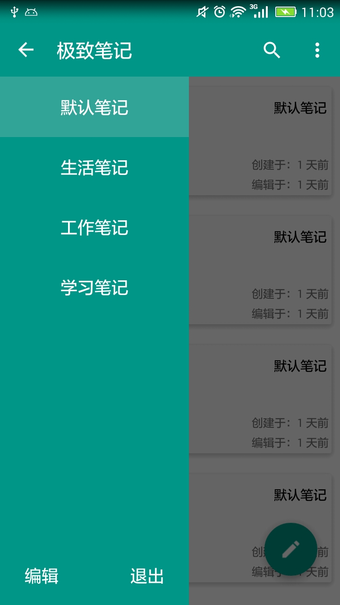
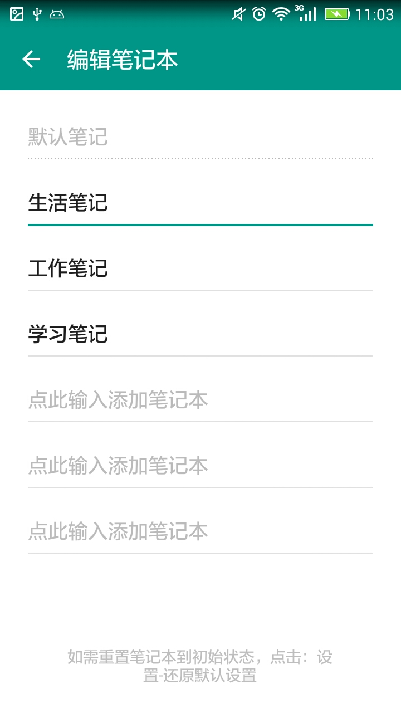
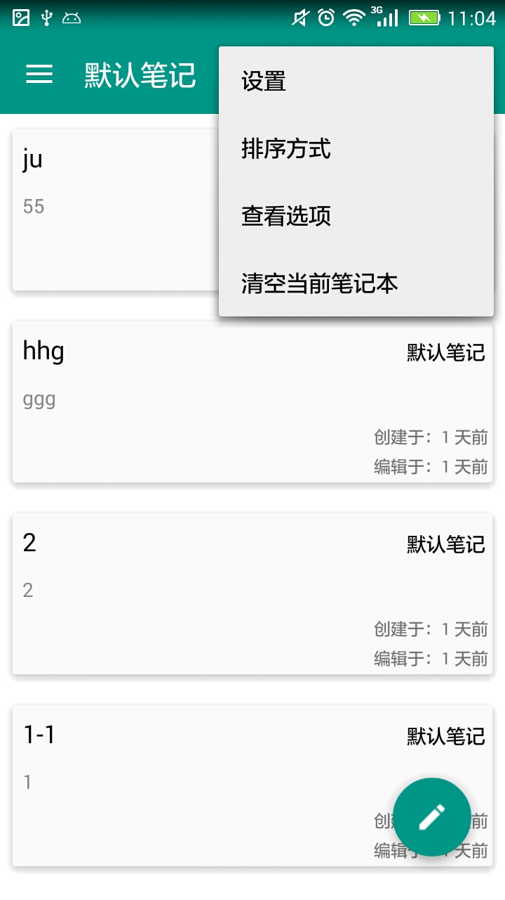
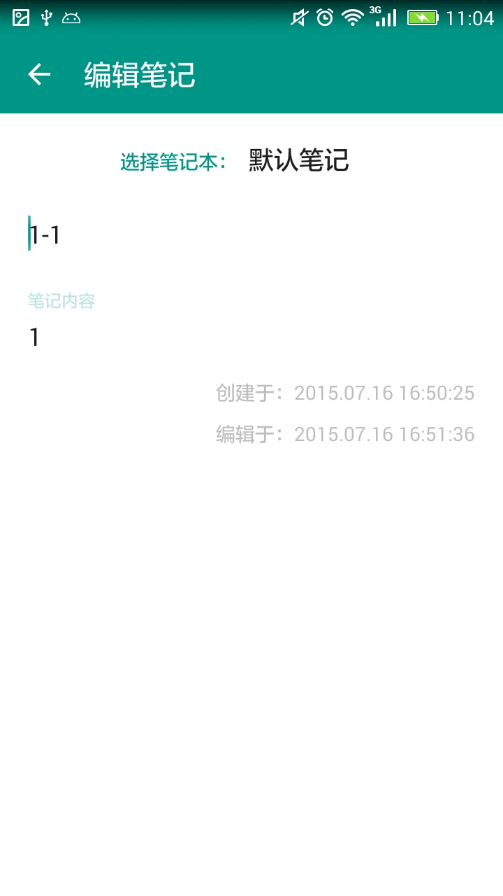
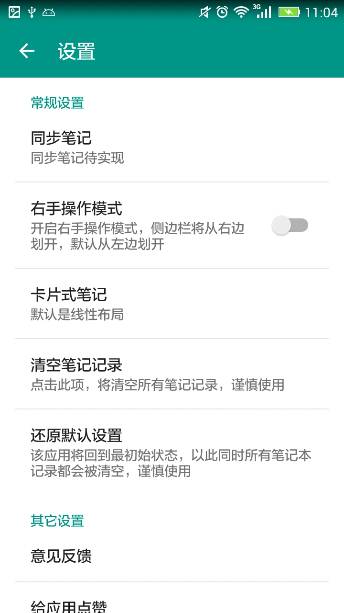

# ScreenShot

# EverNote
自学android两个月，上手练习的一款材料设计风格的个人笔记本，新手值得看一看：

# 学到的东西
1.	使用LitePal框架快速操作数据库
2.  使用Evenbus框架进行组件间通信
3.	Material Design风格的RecyclerView,CardView等各种空间的使用
4.	使用Toolbar完全替代 ActionBar
5.  Drawlayout作为app整体布局

# 后续更新计划
1.	代码逻辑混乱，重构一下代码
2.	主界面activity处理了过多了逻辑，部分menu项处理可以部分放在Fragment中处理，虽然增加了耦合度，但是因为fragment没有其它地方复用，这样做也可以。
3.	RecycleView数据项优化，每次使用LitePal加载当前笔记本的所有记录，内存开销大，可以分页加载,
	limit, offset可以解决该问题，同时SwipeRefreshLayout下拉加载下一页数据库
4.  设置菜单可以更改主题
5.	侧滑菜单可以使用单独的fragment显示，与activiy解耦。自定义侧滑菜单增加提醒分类，提醒参考印象笔记
6.	同步笔记？？？
7.	数据库优化，LitePal用法还有待深入研究，怎么设置主键，而不是采取默认的主键，这样可以减少关联表查询的复杂度。
	单击recycleview项时，通过evenbus怎么传递对象到下一个activity中去，不能通过加入bundle，因为传递过去isSave为false，不能更新该记录。
	目前处理方式重新查询了一遍，降低了效率，需要优化。
8.	加入meterial Design最新特性，使用CoordinatorLayout,AppBarLayout等
9.	采取android MVP模式

# 代码引用库
1.	compile 'com.android.support:recyclerview-v7:22.2.0'
2.	compile 'com.android.support:cardview-v7:22.2.0'
3.	compile 'com.android.support:design:22.2.0'
4.	compile 'com.jakewharton:butterknife:6.1.0'
5.	compile 'com.jenzz:materialpreference:1.3'
6.	compile 'com.rengwuxian.materialedittext:library:2.1.4'
7.	compile 'org.litepal.android:core:1.2.1'
8.	compile 'de.greenrobot:eventbus:2.4.0'